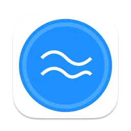
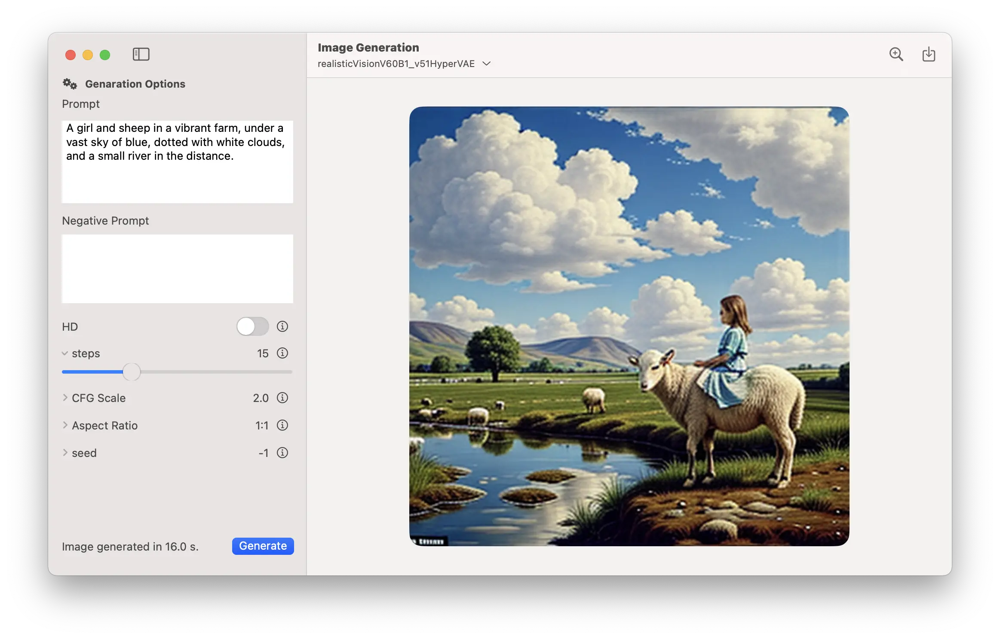

    

# AquariusAI

English | [中文](README_zh.md)

`AquariusAI` is dedicated to researching the ability to independently execute local large models on Apple devices, including Macs, iPhones, and iPads. The objective is to run models downloaded from `hugging face` directly (or after conversion) on these devices, while making full use of the device's inherent computing power (CPU, GPU, and NPU).

## Concept

- CoreML

> Core ML is Apple's native framework for Machine Learning, and also the name of the file format it uses. After you convert a model from (for example) PyTorch to Core ML, you can use it in your Swift apps. The Core ML framework automatically selects the best hardware to run your model on: the CPU, the GPU, or a specialized tensor unit called the Neural Engine. A combination of several of these compute units is also possible, depending on the characteristics of your system and the model details.

- Exporting a model to Core ML

## Features

### Text Generation

Load and run `CoreML` models using [swift-transformers](https://github.com/huggingface/swift-transformers).

### Image Generation

Load and run `CoreML` models using [Core ML Stable Diffusion](https://github.com/apple/ml-stable-diffusion).

### And more...

## Requirements

- macOS 14.0 Sonoma or later.

## Screenshot

